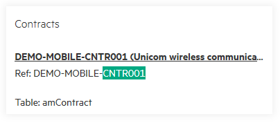

# AM Browser global search

Global search is also the homepage of AM Browser. If an Admin user has defined views with search fields, global search is enabled.

AM Browser searches in all views that have search fields configured on the root table. Search results are displayed in Card/Tile style.

### Search for a field
- Input at least 3 characters.
- Press Enter or click Search to search.

#### Results summary
You will get a table that displays the summary of search results:

- View name
- Return time
- Count (Descend)

#### Results areas
Each result is displayed as a Card/Tile including: 
- View name
- Each title of result (Column: Self)
- Contents with search keyword highlight

### Widget

- Viewer group by category
- Graph group by category
- UCMDB Adapter jobs group by status

