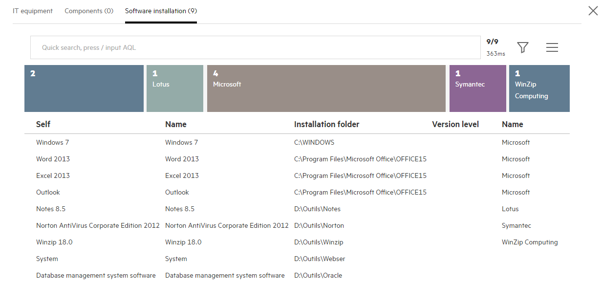

# AM Browser Viewer

After Admin user create views, those will display in Viewer module. 
Power user can access views from Viewer module, Guest user can access a view from URL.

User access a view then query data from AM REST service. Below are areas in Views:
- Header
- Menu
- Table
- Detail and links

### Header
- Title
- Search and filter box
    - Quick search
        - Input without press enter: Filter from front end records
        - Input with press enter: Filter from back end (**View must defined searchable fields**)
    - AQL advanced search
        - Enable or disable toggle from menu
        - Enable or disable toggle by input '/' as first character
        - Display added AQL filters below the input box
- Record counts and return time
    - Records number
        - Current front end records number
        - Total back end records number
        - **Click to get next page data (30 records)**
    - REST return time
    - Automatically get next page data
        - Scroll down to end

> For some reason you may click records numbers to get next page data instead of scroll to end 

### Menu
- Filter menu: Group by and filters
- Vertical / horizontal Graph toggle
- AQL enable toggle
- Full column toggle
- Export and download
    - Download in background
    - Default download manager of browsers (IE, FF, Chrome...)

> In viewer, you may easy to select a field as group by condition, then see the aggregation results.
Each result item can be clicked as a filter, after click, filter will display on top of record list.

### Table
- Header: Fields name and order by
    - Fields name will display alias name (that defined in view) instead of fields' original label
    - Click fields name will display ascent or descend icon, and query records from back end 
- Column
    - Default display 5 columns
    - Click a record to show detail

### Detail
When user click a record, there will be a popup window from right side. In this window, all fields defined in view will be displayed vertically.
And all 1-M links defined in view will be displayed as a Tab page.
- Display all fields
- Display sub links

### Distribution
AM Browser Viewer provided a colorful and bright distribution graph to display group by statistics. It also provided a fast group by and filter functions. 

- Distribution Graph
    - Horizontal (default)
    - Vertical (enable from menu)
    - Allow to click each element as a filter
- Group by
    - Default group by field defined in view
    - Select a field from filter menu manually
- Filter
    - Display AQL filters that added by user
    - Allow to multiple filters, condition is 'AND'

Video:

