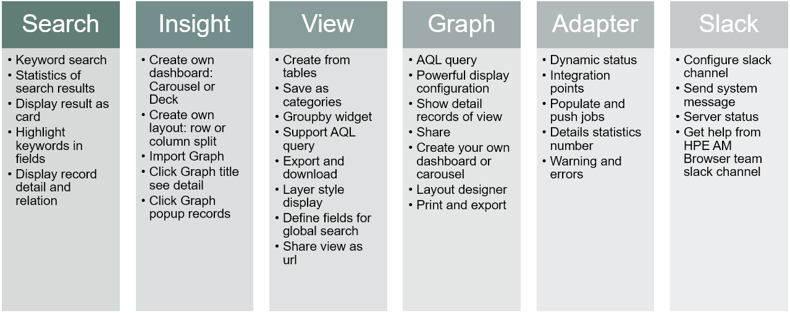
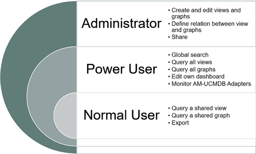

# Asset Manager Browser

Asset Manager Browser (AMB) is a lightweight UI that leverages RESTful API layer to pull data from Asset Manager and simplifies the end user data consumption of ITAM data.

### Features

AMB provides you with the following features.

### Use cases

AMB provides you with the following use cases.

### Roles

AMB has 3 roles:

